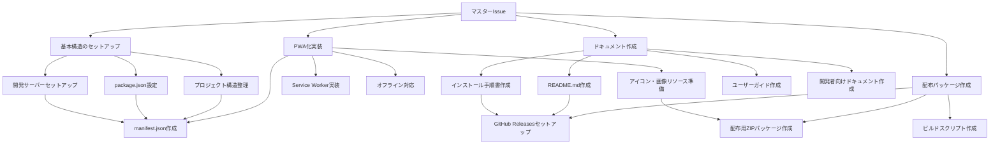

# マスターIssue: 灯油ストーブ消火確認アプリ - ローカル配布可能版の開発

## プロジェクト概要

既存の灯油ストーブ消火確認Webアプリケーションを、ローカルでダウンロード・インストールして誰でも使えるようにする。

### 現状
- 既存のHTML/CSS/JavaScriptアプリケーション（single HTML file）
- localStorage使用
- 4つの工場タブ管理
- 社員の消火確認チェック機能
- 毎日AM3時自動リセット機能

### 目標
1. **ローカル配布可能**: GitHubからダウンロードして誰でも使える
2. **PWA化**: オフラインでも動作可能
3. **簡単インストール**: シンプルな手順で誰でもセットアップ可能
4. **miyabiワークフロー**: 完全自動化されたIssue→PR→Deployパイプライン

## タスク分解（DAG構造）

## サブIssue一覧

### Phase 1: 基本構造のセットアップ
- **Issue #2**: プロジェクト構造整理
  - ラベル: `type:refactor`, `phase:planning`, `priority:P0-Critical`
  - タスク:
    - [ ] publicディレクトリにHTMLファイル配置（完了）
    - [ ] assetsディレクトリ作成（CSS/JS分離の準備）
    - [ ] .gitignore設定
  - 担当: `agent:codegen`
  - 依存: なし

- **Issue #3**: package.json設定とスクリプト整備
  - ラベル: `type:feature`, `phase:development`, `priority:P0-Critical`
  - タスク:
    - [ ] 開発用スクリプト追加（`npm run dev`）
    - [ ] ビルドスクリプト追加（`npm run build`）
    - [ ] プレビュースクリプト追加（`npm run preview`）
  - 担当: `agent:codegen`
  - 依存: Issue #2

- **Issue #4**: ローカル開発サーバーセットアップ
  - ラベル: `type:feature`, `phase:development`, `priority:P1-High`
  - タスク:
    - [ ] 軽量HTTPサーバー導入（例: http-server, serve）
    - [ ] 開発環境の動作確認
  - 担当: `agent:codegen`
  - 依存: Issue #3

### Phase 2: PWA化実装
- **Issue #5**: manifest.json作成
  - ラベル: `type:feature`, `phase:development`, `priority:P0-Critical`
  - タスク:
    - [ ] アプリ名、説明、テーマカラー設定
    - [ ] アイコン設定（複数サイズ）
    - [ ] display: standalone設定
    - [ ] start_url設定
  - 担当: `agent:codegen`
  - 依存: Issue #2

- **Issue #6**: Service Worker実装
  - ラベル: `type:feature`, `phase:development`, `priority:P0-Critical`
  - タスク:
    - [ ] sw.js作成
    - [ ] キャッシュ戦略実装（Cache First）
    - [ ] 静的リソースのプリキャッシュ
    - [ ] Service Worker登録スクリプト追加
  - 担当: `agent:codegen`
  - 依存: Issue #5

- **Issue #7**: オフライン対応とテスト
  - ラベル: `type:test`, `phase:review`, `priority:P1-High`
  - タスク:
    - [ ] オフライン動作確認
    - [ ] localStorageの永続性確認
    - [ ] ネットワーク切断時の挙動テスト
  - 担当: `agent:review`
  - 依存: Issue #6

- **Issue #8**: アイコン・画像リソース準備
  - ラベル: `type:feature`, `design`, `priority:P2-Medium`
  - タスク:
    - [ ] 192x192アイコン作成
    - [ ] 512x512アイコン作成
    - [ ] ファビコン作成
    - [ ] スプラッシュスクリーン画像作成（オプション）
  - 担当: `agent:codegen`
  - 依存: なし

### Phase 3: ドキュメント作成
- **Issue #9**: README.md作成
  - ラベル: `type:docs`, `phase:development`, `priority:P1-High`
  - タスク:
    - [ ] プロジェクト概要
    - [ ] 機能一覧
    - [ ] クイックスタート
    - [ ] 技術スタック
    - [ ] ライセンス情報
  - 担当: `agent:codegen`
  - 依存: なし

- **Issue #10**: インストール手順書作成
  - ラベル: `type:docs`, `priority:P0-Critical`
  - タスク:
    - [ ] Windows向け手順
    - [ ] macOS向け手順
    - [ ] スマートフォン向け手順（PWAインストール）
    - [ ] トラブルシューティング
  - 担当: `agent:codegen`
  - 依存: Issue #6, Issue #7

- **Issue #11**: ユーザーガイド作成
  - ラベル: `type:docs`, `priority:P2-Medium`
  - タスク:
    - [ ] 基本的な使い方
    - [ ] 社員の追加・削除方法
    - [ ] 工場タブの使い方
    - [ ] データリセットのタイミング
    - [ ] FAQ
  - 担当: `agent:codegen`
  - 依存: なし

- **Issue #12**: 開発者向けドキュメント作成
  - ラベル: `type:docs`, `priority:P3-Low`
  - タスク:
    - [ ] ディレクトリ構造説明
    - [ ] カスタマイズ方法
    - [ ] 貢献ガイドライン
  - 担当: `agent:codegen`
  - 依存: なし

### Phase 4: 配布パッケージ作成
- **Issue #13**: ビルドスクリプト作成
  - ラベル: `type:feature`, `phase:development`, `priority:P1-High`
  - タスク:
    - [ ] distディレクトリ作成スクリプト
    - [ ] 必要ファイルのコピー
    - [ ] 不要ファイルの除外
  - 担当: `agent:codegen`
  - 依存: Issue #3

- **Issue #14**: GitHub Releasesセットアップ
  - ラベル: `type:feature`, `deployment`, `priority:P1-High`
  - タスク:
    - [ ] リリースノートテンプレート作成
    - [ ] GitHub Actions for Releases設定
    - [ ] バージョニング戦略決定
  - 担当: `agent:deploy`
  - 依存: Issue #13

- **Issue #15**: 配布用ZIPパッケージ作成
  - ラベル: `type:feature`, `deployment`, `priority:P0-Critical`
  - タスク:
    - [ ] ZIP作成スクリプト
    - [ ] README、ライセンス含める
    - [ ] インストール手順書含める
  - 担当: `agent:deploy`
  - 依存: Issue #13, Issue #9, Issue #10

### Phase 5: 品質保証・デプロイ
- **Issue #16**: セキュリティ監査
  - ラベル: `special:security`, `phase:review`, `priority:P1-High`
  - タスク:
    - [ ] XSS脆弱性チェック
    - [ ] localStorage安全性確認
    - [ ] HTTPS推奨設定
  - 担当: `agent:review`
  - 依存: すべてのコード実装Issue

- **Issue #17**: 最終動作確認とリリース
  - ラベル: `type:test`, `phase:deployment`, `priority:P0-Critical`
  - タスク:
    - [ ] 全機能の動作確認
    - [ ] 複数環境でのテスト（Windows/Mac/Mobile）
    - [ ] v1.0.0リリース
  - 担当: `agent:deploy`
  - 依存: すべてのIssue

## 並行実行可能なタスク

以下のIssueは並行して実行可能:
- Issue #2, #8, #9, #11, #12（互いに依存なし）
- Issue #5, #8（PWA準備）
- Issue #10, #11, #12（ドキュメント系）

## 成功基準

- [ ] GitHubからZIPダウンロードで誰でも使える
- [ ] オフラインで完全動作
- [ ] スマートフォンでPWAとしてインストール可能
- [ ] 日本語ドキュメント完備
- [ ] v1.0.0リリース完了

## 技術スタック

- **フロントエンド**: Pure HTML/CSS/JavaScript（既存）
- **PWA**: Service Worker, Web App Manifest
- **ストレージ**: localStorage
- **配布**: GitHub Releases
- **CI/CD**: GitHub Actions
- **開発ツール**: miyabi自動化ワークフロー

## 推定工数

- Phase 1: 2-3時間
- Phase 2: 3-4時間
- Phase 3: 2-3時間
- Phase 4: 1-2時間
- Phase 5: 1-2時間

**合計**: 9-14時間（Agentの並行実行で短縮可能）

## 関連リンク

- GitHubリポジトリ: https://github.com/ryoma373639/heater-shutdown-checker
- Welcome Issue: https://github.com/ryoma373639/heater-shutdown-checker/issues/1
