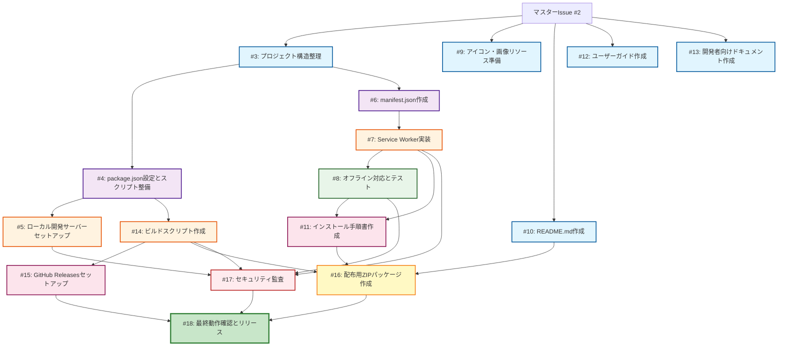

# タスクDAG（Directed Acyclic Graph）- heater-shutdown-checker

## Miyabi Coordinator Agentによるタスク分解と並行実行プラン

### 依存関係グラフ（Mermaid）



## 並行実行プラン

### Wave 1（5タスク並行）- 依存なし
**実行可能時刻: 即座**
- ✅ **Issue #3**: プロジェクト構造整理 `[agent:codegen, P0-Critical]`
- ✅ **Issue #9**: アイコン・画像リソース準備 `[agent:codegen, P2-Medium]`
- ✅ **Issue #10**: README.md作成 `[agent:codegen, P1-High]`
- ✅ **Issue #12**: ユーザーガイド作成 `[agent:codegen, P2-Medium]`
- ✅ **Issue #13**: 開発者向けドキュメント作成 `[agent:codegen, P3-Low]`

**推定時間**: 30-45分（並行実行）

---

### Wave 2（2タスク並行）- Wave 1の#3完了後
**実行可能時刻: Wave 1の#3完了後**
- ⏳ **Issue #4**: package.json設定とスクリプト整備 `[agent:codegen, P0-Critical]`
  - 依存: #3
- ⏳ **Issue #6**: manifest.json作成 `[agent:codegen, P0-Critical]`
  - 依存: #3

**推定時間**: 20-30分（並行実行）

---

### Wave 3（3タスク並行）- Wave 2完了後
**実行可能時刻: Wave 2完了後**
- ⏳ **Issue #5**: ローカル開発サーバーセットアップ `[agent:codegen, P1-High]`
  - 依存: #4
- ⏳ **Issue #7**: Service Worker実装 `[agent:codegen, P0-Critical]`
  - 依存: #6
- ⏳ **Issue #14**: ビルドスクリプト作成 `[agent:codegen, P1-High]`
  - 依存: #4

**推定時間**: 30-45分（並行実行）

---

### Wave 4（1タスク）- Wave 3の#7完了後
**実行可能時刻: Wave 3の#7完了後**
- ⏳ **Issue #8**: オフライン対応とテスト `[agent:review, P1-High]`
  - 依存: #7

**推定時間**: 15-20分

---

### Wave 5（2タスク並行）- Wave 4完了後
**実行可能時刻: Wave 3の#14, Wave 4の#8完了後**
- ⏳ **Issue #11**: インストール手順書作成 `[agent:codegen, P0-Critical]`
  - 依存: #7, #8
- ⏳ **Issue #15**: GitHub Releasesセットアップ `[agent:deploy, P1-High]`
  - 依存: #14

**推定時間**: 20-30分（並行実行）

---

### Wave 6（1タスク）- Wave 5の#11完了後
**実行可能時刻: Wave 2の#10, Wave 3の#14, Wave 5の#11完了後**
- ⏳ **Issue #16**: 配布用ZIPパッケージ作成 `[agent:deploy, P0-Critical]`
  - 依存: #14, #10, #11

**推定時間**: 15-20分

---

### Wave 7（1タスク）- すべてのコード実装完了後
**実行可能時刻: Wave 3, 4のコード実装完了後**
- ⏳ **Issue #17**: セキュリティ監査 `[agent:review, P1-High, special:security]`
  - 依存: #5, #7, #8, #14

**推定時間**: 20-30分

---

### Wave 8（1タスク）- すべて完了後
**実行可能時刻: すべてのIssue完了後**
- ⏳ **Issue #18**: 最終動作確認とリリース `[agent:deploy, P0-Critical]`
  - 依存: すべて

**推定時間**: 30-45分

---

## クリティカルパス（最長経路）

```
#3 → #4 → #7 → #8 → #11 → #16 → #17 → #18
```

**クリティカルパス所要時間**: 約2.5〜3.5時間

**全タスク総時間（並行実行なし）**: 約9〜14時間
**並行実行時の推定時間**: 約2.5〜3.5時間（約70%短縮）

---

## Agent割り当て

### CodeGen Agent（11タスク）
- #3, #4, #5, #6, #7, #9, #10, #11, #12, #13, #14

### Review Agent（2タスク）
- #8, #17

### Deploy Agent（3タスク）
- #15, #16, #18

---

## 優先順位別タスク

### P0-Critical（最優先）
- #3, #4, #6, #11, #16, #18

### P1-High
- #5, #7, #8, #10, #14, #15, #17

### P2-Medium
- #9, #12

### P3-Low
- #13

---

## 実行推奨順序

1. **即座に実行**: Wave 1の5タスク（すべて並行可能）
2. **#3完了後**: Wave 2の2タスク（並行可能）
3. **#4と#6完了後**: Wave 3の3タスク（並行可能）
4. **段階的に実行**: Wave 4〜8（依存関係に従う）

---

## Miyabi Agent実行コマンド

### Wave 1（並行実行）
```bash
npx miyabi agent run codegen --issue=3 &
npx miyabi agent run codegen --issue=9 &
npx miyabi agent run codegen --issue=10 &
npx miyabi agent run codegen --issue=12 &
npx miyabi agent run codegen --issue=13 &
```

### Wave 2（#3完了後）
```bash
npx miyabi agent run codegen --issue=4 &
npx miyabi agent run codegen --issue=6 &
```

### 以降、DAGに従って順次実行

---

🌸 **Miyabi Coordinator Agent**による自動タスク分解・並行実行プラン
